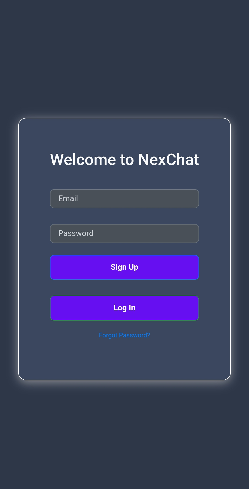
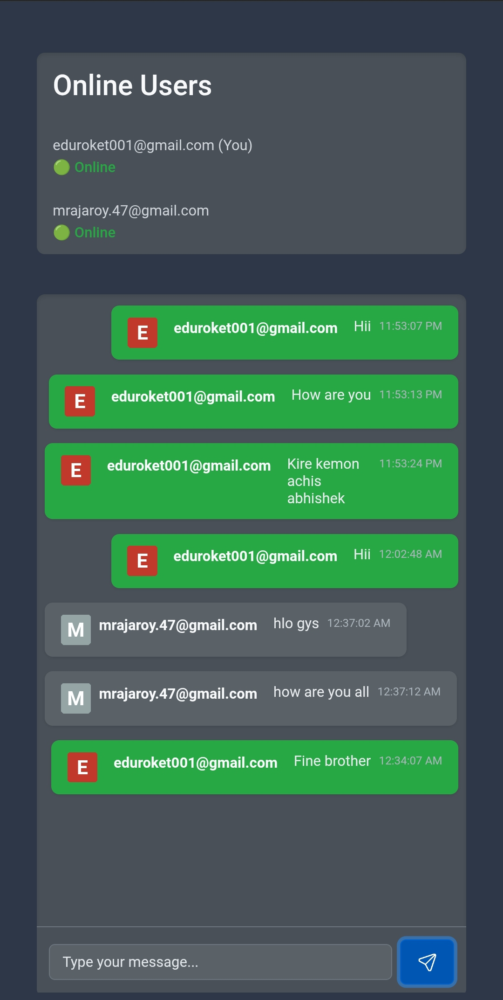

# NexChat - Real-time Chat Application

[](https://opensource.org/licenses/MIT)
[](https://developer.mozilla.org/en-US/docs/Web/JavaScript)
[](https://firebase.google.com/)
[](https://getbootstrap.com/)

## Project Overview

NexChat is a modern, real-time chat application built with JavaScript and leveraging the power of Firebase for backend services. It provides users with a seamless and engaging platform to connect and communicate in real-time. The application features user authentication (signup, login, and password reset), real-time message exchange, online user presence tracking, and a clean, responsive user interface powered by Bootstrap.

## Key Features

* **Real-time Messaging:** Instantly send and receive messages with other online users.
* **User Authentication:** Secure signup, login, and password reset functionality powered by Firebase Auth.
* **Email Verification:** Ensures the authenticity of user accounts through email verification.
* **Online Presence:** Real-time tracking of online users with status indicators and "last seen" timestamps.
* **Profile Avatars:** Displays user avatars, defaulting to letter-based avatars if no profile picture is available.
* **Responsive Design:** Utilizes Bootstrap for a clean and responsive layout that adapts to various screen sizes.
* **Firebase Backend:** Leverages Firebase Realtime Database for real-time data synchronization and Firebase Authentication for user management.
* **User-friendly Interface:** Intuitive and easy-to-use chat interface.

## Screenshots

Here's a look at the login screen:


And the main chat interface:


## Technologies Used

* **Frontend:**
    * JavaScript (ES6+)
    * HTML5
    * CSS3
    * Bootstrap v4.5.2
* **Backend & Services:**
    * Firebase
        * Firebase Authentication
        * Firebase Realtime Database
* **Libraries & Frameworks:**
    * Firebase JavaScript SDK v9.22.2

## Getting Started

To run NexChat locally, follow these steps:

1.  **Clone the Repository:**
    ```bash
    git clone https://github.com/rajaroy47/NexChatApp.git
    cd NexChat
    ```

2.  **Set up Firebase Project:**
    * Go to the [Firebase Console](https://console.firebase.google.com/) and create a new project.
    * Enable **Authentication** (Email/Password sign-in method).
    * Enable **Realtime Database** and note the database URL.

3.  **Configure Firebase Credentials:**
    * Open the `script.js` file.
    * Replace the placeholder values in the `firebaseConfig` object with your Firebase project's credentials (apiKey, authDomain, projectId, storageBucket, messagingSenderId, appId, databaseURL).

    ```javascript
    const firebaseConfig = {
      apiKey: "[YOUR_API_KEY]",
      authDomain: "[YOUR_AUTH_DOMAIN]",
      projectId: "[YOUR_PROJECT_ID]",
      storageBucket: "[YOUR_STORAGE_BUCKET]",
      messagingSenderId: "[YOUR_MESSAGING_SENDER_ID]",
      appId: "[YOUR_APP_ID]",
      databaseURL: "[YOUR_DATABASE_URL]",
    };
    ```

4.  **Open `index.html` in your Browser:**
    * Simply open the `index.html` file in your preferred web browser. The application will connect to your Firebase project.

## Project Structure
* NexChat/
* ├── index.html          # Main HTML file
* ├── script.js           # JavaScript logic (Firebase integration, UI handling)
* ├── style.css           # CSS for custom styling
* ├── send.png            # Send button icon (optional)
* └── README.md

## Future Enhancements

Potential future enhancements for NexChat include:

* Private messaging between users.
* Group chat functionality.
* File and image sharing.
* User profile customization (including profile picture upload).
* Message editing and deletion.
* Notifications for new messages.
* Improved error handling and user feedback.
* Unit and integration testing.
